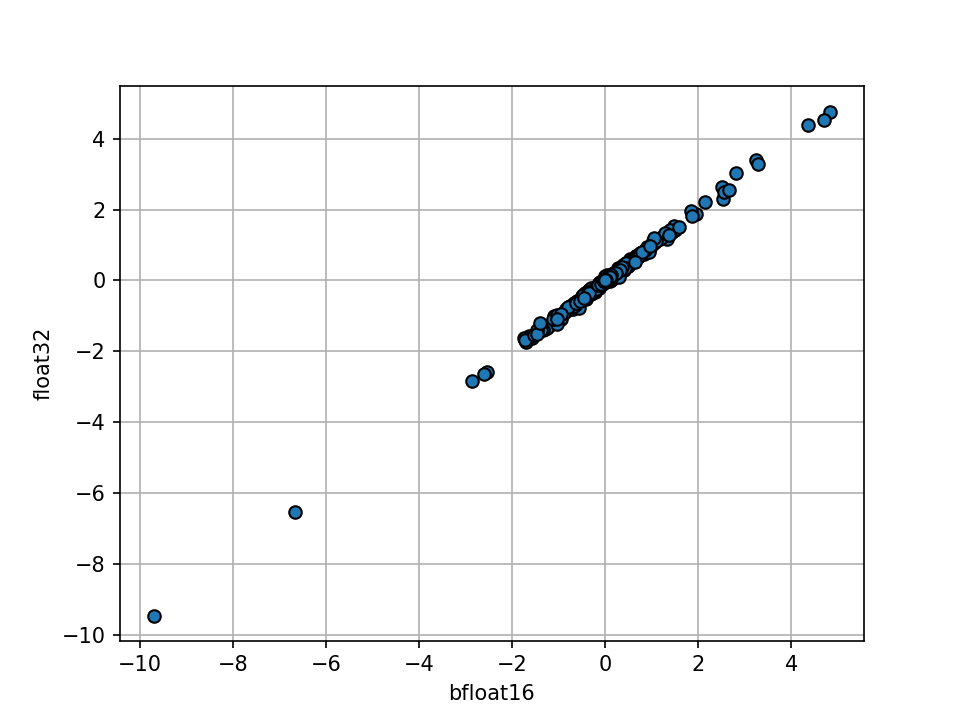
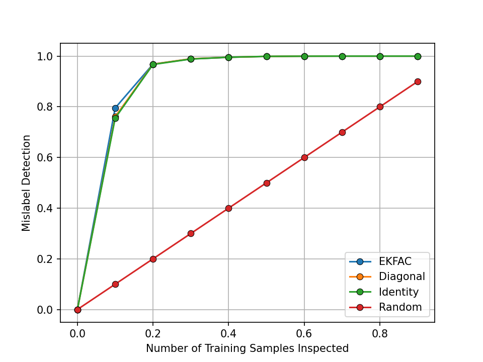

# CIFAR-10 & ResNet-9 Example

This directory contains scripts for training ResNet-9 and computing influence scores on the CIFAR-10 dataset. The pipeline is motivated from the
[TRAK repository](https://github.com/MadryLab/trak/blob/main/examples/cifar_quickstart.ipynb). To get started, please install the necessary packages by running the following command:

```bash
pip install -r requirements.txt
```

## Training

To train ResNet-9 on CIFAR-10, execute:

```bash
python train.py --dataset_dir ./data \
    --checkpoint_dir ./checkpoints \
    --train_batch_size 512 \
    --eval_batch_size 1024 \
    --learning_rate 0.4 \
    --weight_decay 0.001 \
    --num_train_epochs 25 \
    --seed 1004
```

This will train the model using the specified hyperparameters and save the trained checkpoint in the `./checkpoints` directory.

## Computing Pairwise Influence Scores

To compute pairwise influence scores on 2000 query data points using the `ekfac` strategy, run the following command:

```bash
python analyze.py --query_batch_size 1000 \
    --dataset_dir ./data \
    --checkpoint_dir ./checkpoints \
    --factor_strategy ekfac
```

In addition to `ekfac`, you can also use `identity`, `diagonal`, and `kfac` as the `factor_strategy`. 
On an A100 (80GB) GPU, computation takes approximately 2 minutes, including EKFAC factor calculation:

```
----------------------------------------------------------------------------------------------------------------------------------
|  Action                       |  Mean duration (s)    |  Num calls            |  Total time (s)       |  Percentage %         |
----------------------------------------------------------------------------------------------------------------------------------
|  Total                        |  -                    |  11                   |  106.38               |  100 %                |
----------------------------------------------------------------------------------------------------------------------------------
|  Compute Pairwise Score       |  46.745               |  1                    |  46.745               |  43.941               |
|  Fit Lambda                   |  34.885               |  1                    |  34.885               |  32.793               |
|  Fit Covariance               |  22.538               |  1                    |  22.538               |  21.187               |
|  Perform Eigendecomposition   |  0.91424              |  1                    |  0.91424              |  0.85941              |
|  Save Pairwise Score          |  0.81219              |  1                    |  0.81219              |  0.76348              |
|  Save Covariance              |  0.22351              |  1                    |  0.22351              |  0.21011              |
|  Save Eigendecomposition      |  0.21617              |  1                    |  0.21617              |  0.20321              |
|  Save Lambda                  |  0.031038             |  1                    |  0.031038             |  0.029177             |
|  Load Eigendecomposition      |  0.010442             |  1                    |  0.010442             |  0.0098156            |
|  Load All Factors             |  0.0026517            |  1                    |  0.0026517            |  0.0024927            |
|  Load Covariance              |  0.0016419            |  1                    |  0.0016419            |  0.0015435            |
----------------------------------------------------------------------------------------------------------------------------------
```

To use AMP for faster computation, add the `--use_half_precision` flag:

```bash
python analyze.py --query_batch_size 1000 \
    --dataset_dir ./data \
    --checkpoint_dir ./checkpoints \
    --factor_strategy ekfac \
    --use_half_precision
```

This reduces computation time to about 40 seconds on an A100 (80GB) GPU:

```
----------------------------------------------------------------------------------------------------------------------------------
|  Action                       |  Mean duration (s)    |  Num calls            |  Total time (s)       |  Percentage %         |
----------------------------------------------------------------------------------------------------------------------------------
|  Total                        |  -                    |  11                   |  35.965               |  100 %                |
----------------------------------------------------------------------------------------------------------------------------------
|  Compute Pairwise Score       |  18.012               |  1                    |  18.012               |  50.082               |
|  Fit Lambda                   |  9.2271               |  1                    |  9.2271               |  25.656               |
|  Fit Covariance               |  7.134                |  1                    |  7.134                |  19.836               |
|  Perform Eigendecomposition   |  0.87962              |  1                    |  0.87962              |  2.4457               |
|  Save Pairwise Score          |  0.45432              |  1                    |  0.45432              |  1.2632               |
|  Save Covariance              |  0.12861              |  1                    |  0.12861              |  0.35759              |
|  Save Eigendecomposition      |  0.11296              |  1                    |  0.11296              |  0.31407              |
|  Save Lambda                  |  0.010712             |  1                    |  0.010712             |  0.029784             |
|  Load All Factors             |  0.002736             |  1                    |  0.002736             |  0.0076074            |
|  Load Covariance              |  0.0016696            |  1                    |  0.0016696            |  0.0046421            |
|  Load Eigendecomposition      |  0.0014892            |  1                    |  0.0014892            |  0.0041406            |
----------------------------------------------------------------------------------------------------------------------------------
```

Run `half_precision_analysis.py` to verify that AMP-computed scores maintain high correlations with default configuration scores.

<p align="center">
<a href="#"></a>
</p>

## Visualizing Influential Training Images

For a tutorial on visualizing top influential training images, refer to [this Colab notebook](https://colab.research.google.com/drive/1KIwIbeJh_om4tRwceuZ005fVKDsiXKgr?usp=sharing)

## Mislabeled Data Detection

We can use self-influence scores (see **Section 5.4** for the [paper](https://arxiv.org/pdf/1703.04730.pdf)) to detect mislabeled examples. 
First, train the model with 10% of the training examples mislabeled:

```bash
python train.py --dataset_dir ./data \
    --corrupt_percentage 0.1 \
    --checkpoint_dir ./checkpoints \
    --train_batch_size 512 \
    --eval_batch_size 1024 \
    --learning_rate 0.4 \
    --weight_decay 0.001 \
    --num_train_epochs 25 \
    --seed 1004
```

Then compute self-influence scores:

```bash
python detect_mislabeled_dataset.py --dataset_dir ./data \
    --corrupt_percentage 0.1 \
    --checkpoint_dir ./checkpoints \
    --factor_strategy ekfac
```

On an A100 (80GB) GPU, this takes approximately 2 minutes:

```
----------------------------------------------------------------------------------------------------------------------------------
|  Action                       |  Mean duration (s)    |  Num calls            |  Total time (s)       |  Percentage %         |
----------------------------------------------------------------------------------------------------------------------------------
|  Total                        |  -                    |  11                   |  121.85               |  100 %                |
----------------------------------------------------------------------------------------------------------------------------------
|  Compute Self-Influence Score |  62.778               |  1                    |  62.778               |  51.519               |
|  Fit Lambda                   |  35.174               |  1                    |  35.174               |  28.866               |
|  Fit Covariance               |  22.582               |  1                    |  22.582               |  18.532               |
|  Perform Eigendecomposition   |  0.82656              |  1                    |  0.82656              |  0.67832              |
|  Save Covariance              |  0.2478               |  1                    |  0.2478               |  0.20336              |
|  Save Eigendecomposition      |  0.22042              |  1                    |  0.22042              |  0.18088              |
|  Save Lambda                  |  0.018463             |  1                    |  0.018463             |  0.015152             |
|  Load All Factors             |  0.0027554            |  1                    |  0.0027554            |  0.0022612            |
|  Load Covariance              |  0.0016607            |  1                    |  0.0016607            |  0.0013628            |
|  Load Eigendecomposition      |  0.0015408            |  1                    |  0.0015408            |  0.0012645            |
|  Save Self-Influence Score    |  0.0010841            |  1                    |  0.0010841            |  0.00088966           |
----------------------------------------------------------------------------------------------------------------------------------
```

By inspecting just 10% of the dataset, about 80% of mislabeled data points can be detected (97% by inspecting 20%).

<p align="center">
<a href="#"></a>
</p>