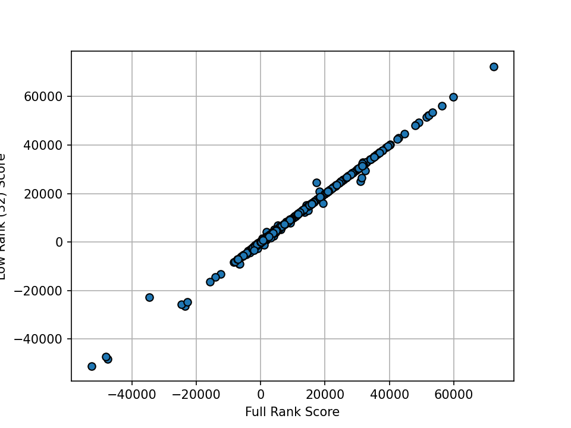

# GLUE & BERT Example

This directory contains scripts for fine-tuning BERT on GLUE benchmark. The pipeline is motivated from [HuggingFace Example](https://github.com/huggingface/transformers/tree/main/examples/pytorch/text-classification).
Please begin by installing necessary packages.
```bash
pip install -r requirements.txt
```

## Training

To fine-tune BERT on some specific dataset, run the following command (we are using `SST2` dataset):
```bash
python train.py --dataset_name sst2 \
    --checkpoint_dir ./checkpoints \
    --train_batch_size 32 \
    --eval_batch_size 32 \
    --learning_rate 3e-05 \
    --weight_decay 0.01 \
    --num_train_epochs 3 \
    --seed 1004
```

## Computing Pairwise Influence Scores

To obtain a pairwise influence scores on maximum of 2000 query data points using `ekfac`, run the following command:
```bash
python analyze.py --dataset_name sst2 \
    --query_batch_size 175 \
    --train_batch_size 128 \
    --checkpoint_dir ./checkpoints \
    --factor_strategy ekfac
```
On A100 (80GB), it takes roughly 80 minutes to compute the pairwise scores for SST2 with around 900 query data points 
(including computing EKFAC factors).

We can also use query batching (low-rank approximation to the query gradient) to compute influence scores with a 
larger query batch size.
```bash
python analyze.py --dataset_name sst2 \
    --query_gradient_rank 32 \
    --query_batch_size 436 \
    --train_batch_size 256 \
    --checkpoint_dir ./checkpoints \
    --factor_strategy ekfac
```
On A100 (80GB), it takes less than 4 hours to compute the pairwise scores with query batching (including computing EKFAC factors).

Assuming that you ran above two commands, `query_batching_analysis.py`
contains code to compute the correlations between the full rank prediction and low-rank scores.

<p align="center">
<a href="#"></a>
</p>
The averaged correlations between the low-rank and full rank scores for 100 data points is 0.98.

## Counterfactual Evaluation

We plan to add a simplified demo for counterfactual evaluation on the RTE dataset soon.

<p align="center">
<a href="#"></a>
</p>