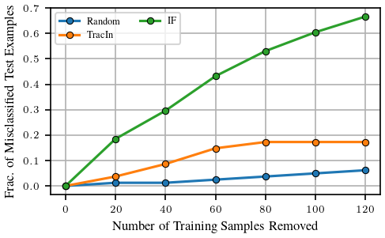

# GLUE & BERT Example

This directory contains scripts for fine-tuning BERT and computing influence scores on the GLUE benchmark. The pipeline is motivated from [this HuggingFace Example](https://github.com/huggingface/transformers/tree/main/examples/pytorch/text-classification).
To get started, please install the necessary packages:

```bash
pip install -r requirements.txt
```

## Training

To fine-tune BERT on a specific dataset, run the following command (we are using the SST2 dataset in this example):

```bash
python train.py --dataset_name sst2 \
    --checkpoint_dir ./checkpoints \
    --train_batch_size 32 \
    --eval_batch_size 32 \
    --learning_rate 3e-05 \
    --weight_decay 0.01 \
    --num_train_epochs 3 \
    --seed 1004
```

This will save the trained checkpoint in the `./checkpoints` directory.

## Computing Pairwise Influence Scores

To obtain pairwise influence scores on a maximum of 2000 query data points using `ekfac`, run the following command:

```bash
python analyze.py --dataset_name sst2 \
    --query_batch_size 175 \
    --train_batch_size 128 \
    --checkpoint_dir ./checkpoints \
    --factor_strategy ekfac
```

On an A100 (80GB), it takes roughly 90 minutes to compute the pairwise scores for SST2 (including computing EKFAC factors):

```
----------------------------------------------------------------------------------------------------------------------------------
|  Action                       |  Mean duration (s)    |  Num calls            |  Total time (s)       |  Percentage %         |
----------------------------------------------------------------------------------------------------------------------------------
|  Total                        |  -                    |  11                   |  5088.0               |  100 %                |
----------------------------------------------------------------------------------------------------------------------------------
|  Fit Lambda                   |  2370.0               |  1                    |  2370.0               |  46.581               |
|  Compute Pairwise Score       |  2222.4               |  1                    |  2222.4               |  43.679               |
|  Fit Covariance               |  478.83               |  1                    |  478.83               |  9.411                |
|  Perform Eigendecomposition   |  10.587               |  1                    |  10.587               |  0.20808              |
|  Save Eigendecomposition      |  2.5419               |  1                    |  2.5419               |  0.049958             |
|  Save Covariance              |  2.3878               |  1                    |  2.3878               |  0.046931             |
|  Save Lambda                  |  0.66905              |  1                    |  0.66905              |  0.01315              |
|  Save Pairwise Score          |  0.51374              |  1                    |  0.51374              |  0.010097             |
|  Load All Factors             |  0.01321              |  1                    |  0.01321              |  0.00025963           |
|  Load Covariance              |  0.0081149            |  1                    |  0.0081149            |  0.00015949           |
|  Load Eigendecomposition      |  0.0079874            |  1                    |  0.0079874            |  0.00015699           |
----------------------------------------------------------------------------------------------------------------------------------
```

For faster computation, use half precision:

```bash
python analyze.py --dataset_name sst2 \
    --query_batch_size 175 \
    --train_batch_size 128 \
    --checkpoint_dir ./checkpoints \
    --factor_strategy ekfac \
    --use_half_precision
```

This reduces computation time to about 20 minutes on an A100 (80GB) GPU.

```
----------------------------------------------------------------------------------------------------------------------------------
|  Action                       |  Mean duration (s)    |  Num calls            |  Total time (s)       |  Percentage %         |
----------------------------------------------------------------------------------------------------------------------------------
|  Total                        |  -                    |  11                   |  1222.4               |  100 %                |
----------------------------------------------------------------------------------------------------------------------------------
|  Compute Pairwise Score       |  582.08               |  1                    |  582.08               |  47.617               |
|  Fit Lambda                   |  543.55               |  1                    |  543.55               |  44.465               |
|  Fit Covariance               |  83.877               |  1                    |  83.877               |  6.8616               |
|  Perform Eigendecomposition   |  9.4054               |  1                    |  9.4054               |  0.76942              |
|  Save Eigendecomposition      |  1.516                |  1                    |  1.516                |  0.12401              |
|  Save Covariance              |  1.434                |  1                    |  1.434                |  0.11731              |
|  Save Lambda                  |  0.28022              |  1                    |  0.28022              |  0.022924             |
|  Save Pairwise Score          |  0.24123              |  1                    |  0.24123              |  0.019734             |
|  Load All Factors             |  0.01241              |  1                    |  0.01241              |  0.0010152            |
|  Load Covariance              |  0.0080553            |  1                    |  0.0080553            |  0.00065897           |
|  Load Eigendecomposition      |  0.0077278            |  1                    |  0.0077278            |  0.00063218           |
----------------------------------------------------------------------------------------------------------------------------------
```

## Counterfactual Evaluation

Let's evaluate the impact of removing top positively influential training examples on query misclassification. 
First, compute pairwise influence scores for the `RTE` dataset (the below commands used a single A100 GPU):

```bash
python train.py --dataset_name rte \
    --checkpoint_dir ./checkpoints \
    --train_batch_size 32 \
    --eval_batch_size 32 \
    --learning_rate 2e-05 \
    --weight_decay 0.01 \
    --num_train_epochs 3 \
    --seed 0

python analyze.py --dataset_name rte \
    --query_batch_size 70 \
    --train_batch_size 128 \
    --checkpoint_dir ./checkpoints \
    --factor_strategy ekfac
    
python analyze.py --dataset_name rte \
    --query_batch_size 70 \
    --train_batch_size 128 \
    --checkpoint_dir ./checkpoints \
    --factor_strategy diagonal
```

Use `run_counterfactual.py` to run the counterfactual experiment. See [our paper](https://arxiv.org/abs/2405.12186) for the detailed setup.

<p align="center">
<a href="#"></a>
</p>

## Evaluating Linear Datamodeling Score

The `evaluate_lds.py` script computes the [linear datamodeling score (LDS)](https://arxiv.org/abs/2303.14186). It measures the LDS obtained by 
retraining the network 500 times with different subsets of the dataset (5 repeats and 100 masks). 

<div align="center">

| Strategy                 | LDS	 |
|--------------------------|:----:|
| `identity`               | 0.10 |
| `diagonal`               | 0.15 |
| `kfac`                   | 0.32 |
| `ekfac`                  | 0.32 |
| `ekfac` (half precision) | 0.32 |

</div>

The script can also print top influential sequences for a given query.

```
Query Example:
 Sentence1: The west has preferred to focus on endangered animals, rather than endangered humans. African elephants are hunted down and stripped of tusks and hidden by poachers. Their numbers in Africa slumped from 1.2m to 600,000 in a decade until CITES - the Convention on International Trade in Endangered Species - banned the trade in ivory.
 Sentence2: African elephants are endangered by ivory poachers.
 Label: 0
 
Top Influential Example:
 Sentence1: The article also mentions the greater prevalence of obesity among two minority populations, African-Americans and Hispanic/Latino, but does not consider in its analysis of the increase in obesity the increase of these these populations as a proportion of the United States population.  African-Americans and Hispanic/Latinos have a higher rates of obesity than White Americans, while Asian-Americans have a relatively low rate of obesity. Despite only representing one third of the U.S. population, African-Americans and Hispanic/Latinos represent about one half of the population growth.
 Sentence2: African-Americans are a minority in the U.S.
 Label: 0
```