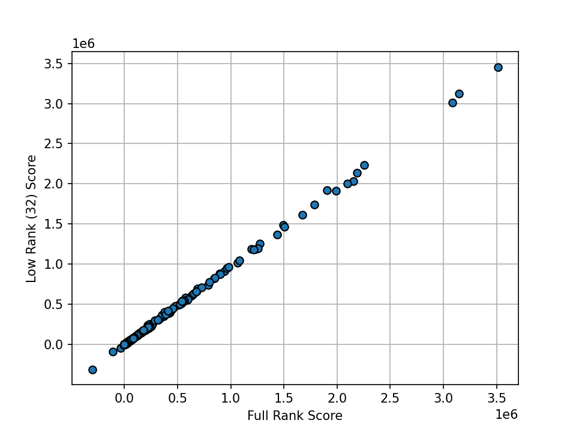

# ImageNet & ResNet-50 Example

This directory contains scripts for computing influence scores on the ImageNet dataset using ResNet-50.
To get started, please install the necessary packages by running:

```bash
pip install -r requirements.txt
```

We will use the pre-trained ResNet-50 model from `torchvision.models.resnet50`.

## Computing Pairwise Influence Scores

To compute pairwise influence scores on 1000 query data points using the `ekfac` factorization strategy, run the following command:

```bash
python analyze.py --dataset_dir PATH_TO_IMAGENET \
    --query_gradient_rank -1 \
    --query_batch_size 100 \
    --train_batch_size 256 \
    --factor_strategy ekfac
```

Replace `PATH_TO_IMAGENET` with the path to your ImageNet dataset directory. On an A100 (80GB) GPU, it takes approximately 11 hours to compute the pairwise scores (including computing EKFAC factors):

```
----------------------------------------------------------------------------------------------------------------------------------
|  Action                       |  Mean duration (s)    |  Num calls            |  Total time (s)       |  Percentage %         |
----------------------------------------------------------------------------------------------------------------------------------
|  Total                        |  -                    |  11                   |  4.072e+04            |  100 %                |
----------------------------------------------------------------------------------------------------------------------------------
|  Compute Pairwise Score       |  3.9136e+04           |  1                    |  3.9136e+04           |  96.111               |
|  Fit Lambda                   |  1056.7               |  1                    |  1056.7               |  2.5952               |
|  Fit Covariance               |  454.05               |  1                    |  454.05               |  1.1151               |
|  Save Pairwise Score          |  49.141               |  1                    |  49.141               |  0.12068              |
|  Perform Eigendecomposition   |  10.589               |  1                    |  10.589               |  0.026006             |
|  Save Covariance              |  5.7108               |  1                    |  5.7108               |  0.014025             |
|  Save Eigendecomposition      |  5.5442               |  1                    |  5.5442               |  0.013616             |
|  Save Lambda                  |  0.97504              |  1                    |  0.97504              |  0.0023945            |
|  Load Eigendecomposition      |  0.52786              |  1                    |  0.52786              |  0.0012963            |
|  Load Covariance              |  0.30319              |  1                    |  0.30319              |  0.00074458           |
|  Load All Factors             |  0.15671              |  1                    |  0.15671              |  0.00038485           |
----------------------------------------------------------------------------------------------------------------------------------
```

Query batching (low-rank approximation to the query gradient; see **Section 3.2.2** from the paper) can be used to compute influence scores with a larger query batch size:

```bash
python analyze.py --dataset_dir PATH_TO_IMAGENET \
    --query_gradient_rank 32 \
    --query_batch_size 256 \
    --train_batch_size 256 \
    --factor_strategy ekfac
```

On an A100 (80GB) GPU, it takes roughly 3 hours to compute the pairwise scores with query batching:

```
----------------------------------------------------------------------------------------------------------------------------------
|  Action                       |  Mean duration (s)    |  Num calls            |  Total time (s)       |  Percentage %         |
----------------------------------------------------------------------------------------------------------------------------------
|  Total                        |  -                    |  3                    |  7352.8               |  100 %                |
----------------------------------------------------------------------------------------------------------------------------------
|  Compute Pairwise Score       |  7340.8               |  1                    |  7340.8               |  99.836               |
|  Save Pairwise Score          |  12.026               |  1                    |  12.026               |  0.16355              |
|  Load All Factors             |  0.0099941            |  1                    |  0.0099941            |  0.00013592           |
----------------------------------------------------------------------------------------------------------------------------------
```

Assuming you ran the above two commands, `query_batching_analysis.py` contains code to compute the correlations between the full-rank and low-rank scores.

<p align="center">
<a href="#"></a>
</p>

The averaged correlations between the low-rank and full rank scores for 100 data points is 0.94.
For even more efficient computation, use half precision:

```bash
python analyze.py --dataset_dir PATH_TO_IMAGENET \
    --query_gradient_rank 32 \
    --query_batch_size 500 \
    --train_batch_size 512 \
    --factor_strategy ekfac \
    --use_half_precision
```

This reduces computation time to about 85 minutes on an A100 (80GB) GPU:

```
----------------------------------------------------------------------------------------------------------------------------------
|  Action                       |  Mean duration (s)    |  Num calls            |  Total time (s)       |  Percentage %         |
----------------------------------------------------------------------------------------------------------------------------------
|  Total                        |  -                    |  11                   |  3023.7               |  100 %                |
----------------------------------------------------------------------------------------------------------------------------------
|  Compute Pairwise Score       |  2621.2               |  1                    |  2621.2               |  86.688               |
|  Fit Lambda                   |  232.3                |  1                    |  232.3                |  7.6825               |
|  Fit Covariance               |  157.36               |  1                    |  157.36               |  5.204                |
|  Perform Eigendecomposition   |  5.745                |  1                    |  5.745                |  0.19                 |
|  Save Pairwise Score          |  5.6676               |  1                    |  5.6676               |  0.18744              |
|  Save Covariance              |  0.70454              |  1                    |  0.70454              |  0.0233               |
|  Save Eigendecomposition      |  0.61539              |  1                    |  0.61539              |  0.020352             |
|  Save Lambda                  |  0.092784             |  1                    |  0.092784             |  0.0030685            |
|  Load Covariance              |  0.013714             |  1                    |  0.013714             |  0.00045354           |
|  Load All Factors             |  0.0088742            |  1                    |  0.0088742            |  0.00029348           |
|  Load Eigendecomposition      |  0.0056237            |  1                    |  0.0056237            |  0.00018599           |
----------------------------------------------------------------------------------------------------------------------------------
```

## Computing Pairwise Influence Scores with DDP

You can also use [DistributedDataParallel (DDP)](https://pytorch.org/tutorials/intermediate/ddp_tutorial.html) to speed up influence computations. To run influence analysis with four A100 (80GB) GPUs and query batching, use the command:

```bash
torchrun --standalone --nnodes=1 --nproc-per-node=4 ddp_analyze.py --dataset_dir PATH_TO_IMAGENET \
    --query_gradient_rank 32 \
    --factor_batch_size 512 \
    --query_batch_size 100 \
    --train_batch_size 256 \
    --factor_strategy ekfac
```

It takes approximately 1 hour to compute the pairwise scores:

```
----------------------------------------------------------------------------------------------------------------------------------
|  Action                       |  Mean duration (s)    |  Num calls            |  Total time (s)       |  Percentage %         |
----------------------------------------------------------------------------------------------------------------------------------
|  Total                        |  -                    |  11                   |  3423.3               |  100 %                |
----------------------------------------------------------------------------------------------------------------------------------
|  Compute Pairwise Score       |  2917.2               |  1                    |  2917.2               |  85.215               |
|  Fit Lambda                   |  298.62               |  1                    |  298.62               |  8.7232               |
|  Fit Covariance               |  137.9                |  1                    |  137.9                |  4.0282               |
|  Save Pairwise Score          |  48.122               |  1                    |  48.122               |  1.4057               |
|  Perform Eigendecomposition   |  7.7503               |  1                    |  7.7503               |  0.2264               |
|  Save Eigendecomposition      |  5.9978               |  1                    |  5.9978               |  0.1752               |
|  Save Covariance              |  5.7442               |  1                    |  5.7442               |  0.1678               |
|  Save Lambda                  |  0.95602              |  1                    |  0.95602              |  0.027927             |
|  Load Covariance              |  0.5718               |  1                    |  0.5718               |  0.016703             |
|  Load Eigendecomposition      |  0.34755              |  1                    |  0.34755              |  0.010153             |
|  Load All Factors             |  0.13107              |  1                    |  0.13107              |  0.0038288            |
----------------------------------------------------------------------------------------------------------------------------------
```

You can use more GPUs to further speed up the influence computations (or use AMP + half precision).
