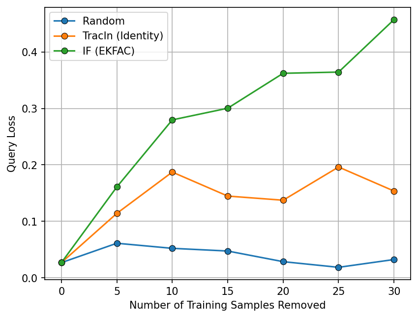

# UCI Regression Example

This directory contains scripts for training a regression model and conducting influence analysis using datasets from the [UCI Machine Learning Repository](https://archive.ics.uci.edu/datasets). 
To get started, please install the necessary packages by running the following command:

```bash
pip install -r requirements.txt
```

## Training

To train a regression model on the `Concrete` dataset, run the following command:

```bash
python train.py --dataset_name concrete \
    --dataset_dir ./data \
    --output_dir ./checkpoints \
    --train_batch_size 32 \
    --eval_batch_size 1024 \
    --learning_rate 0.03 \
    --weight_decay 1e-05 \
    --num_train_epochs 20 \
    --seed 1004
```

This will train the model using the specified hyperparameters and save the trained checkpoint in the `./checkpoints` directory.

## Computing Pairwise Influence Scores

To compute pairwise influence scores using the `ekfac` strategy, run the following command:

```bash
python analyze.py --dataset_name concrete \
    --dataset_dir ./data \
    --checkpoint_dir ./checkpoints \
    --factor_strategy ekfac
```

You can also use `identity`, `diagonal`, and `kfac` for `factor_strategy`. To measure the wall-clock time of computing influence scores, you can enable the `profile` flag:

```
----------------------------------------------------------------------------------------------------------------------------------
|  Action                    	|  Mean duration (s)	|  Num calls      	|  Total time (s) 	|  Percentage %   	|
----------------------------------------------------------------------------------------------------------------------------------
|  Total                     	|  -              	|  11             	|  0.28983        	|  100 %          	|
----------------------------------------------------------------------------------------------------------------------------------
|  Compute Pairwise Score    	|  0.15112        	|  1              	|  0.15112        	|  52.141         	|
|  Fit Lambda                	|  0.094882       	|  1              	|  0.094882       	|  32.737         	|
|  Fit Covariance            	|  0.031336       	|  1              	|  0.031336       	|  10.812         	|
|  Perform Eigendecomposition	|  0.006672       	|  1              	|  0.006672       	|  2.302          	|
|  Save Eigendecomposition   	|  0.0013218      	|  1              	|  0.0013218      	|  0.45607        	|
|  Save Covariance           	|  0.0013099      	|  1              	|  0.0013099      	|  0.45196        	|
|  Load All Factors          	|  0.00073975     	|  1              	|  0.00073975     	|  0.25523        	|
|  Save Lambda               	|  0.00073158     	|  1              	|  0.00073158     	|  0.25242        	|
|  Load Covariance           	|  0.00062487     	|  1              	|  0.00062487     	|  0.2156         	|
|  Save Pairwise Score       	|  0.00058254     	|  1              	|  0.00058254     	|  0.20099        	|
|  Load Eigendecomposition   	|  0.00050846     	|  1              	|  0.00050846     	|  0.17543        	|
----------------------------------------------------------------------------------------------------------------------------------
```

## Counterfactual Evaluation

To run the subset removal counterfactual evaluation, please refer to the `tutorial.ipynb` notebook.
Note that `TracIn` uses the final checkpoint instead of the intermediate checkpoints throughout training.

<p align="center">
<a href="#"></a>
</p>
