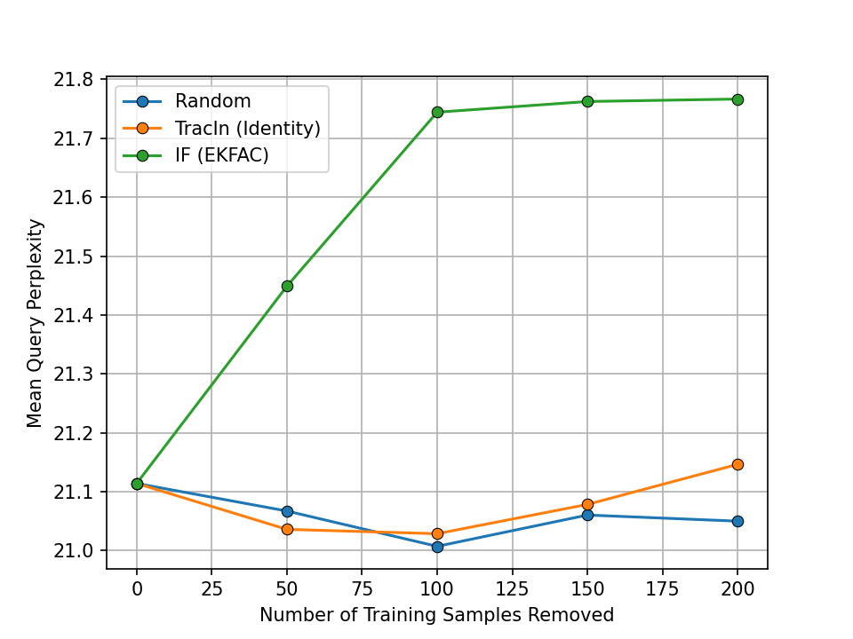

# WikiText & GPT-2 Example

This repository contains scripts for fine-tuning GPT-2 and computing influence scores on the WikiText2 dataset. The pipeline is inspired by [this HuggingFace example](https://github.com/huggingface/transformers/tree/main/examples/pytorch/language-modeling).
Install the necessary packages:

```bash
pip install -r requirements.txt
```

## Training

To fine-tune GPT-2, run:

```bash
python train.py --checkpoint_dir ./checkpoints \
    --train_batch_size 8 \
    --eval_batch_size 16 \
    --learning_rate 3e-05 \
    --weight_decay 0.01 \
    --num_train_epochs 3 \
    --seed 1004
```

This will fine-tune the model using the specified hyperparameters and save the final checkpoint in the `./checkpoints` directory.

## Computing Pairwise Influence Scores

To compute pairwise influence scores using the `ekfac` strategy, run the following command:

```bash
python analyze.py --query_batch_size 32 \
    --train_batch_size 64 \
    --checkpoint_dir ./checkpoints \
    --factor_strategy ekfac
```

You can also use `identity`, `diagonal`, and `kfac` for `factor_strategy`. On an A100 (80GB) GPU, this process takes approximately 40 minutes:

```
----------------------------------------------------------------------------------------------------------------------------------
|  Action                       |  Mean duration (s)    |  Num calls            |  Total time (s)       |  Percentage %         |
----------------------------------------------------------------------------------------------------------------------------------
|  Total                        |  -                    |  11                   |  2357.4               |  100 %                |
----------------------------------------------------------------------------------------------------------------------------------
|  Compute Pairwise Score       |  1888.2               |  1                    |  1888.2               |  80.098               |
|  Fit Lambda                   |  274.64               |  1                    |  274.64               |  11.651               |
|  Fit Covariance               |  180.27               |  1                    |  180.27               |  7.6471               |
|  Perform Eigendecomposition   |  7.7754               |  1                    |  7.7754               |  0.32984              |
|  Save Eigendecomposition      |  3.0652               |  1                    |  3.0652               |  0.13003              |
|  Save Covariance              |  2.6799               |  1                    |  2.6799               |  0.11368              |
|  Save Lambda                  |  0.66036              |  1                    |  0.66036              |  0.028013             |
|  Load Covariance              |  0.033343             |  1                    |  0.033343             |  0.0014144            |
|  Save Pairwise Score          |  0.016471             |  1                    |  0.016471             |  0.0006987            |
|  Load All Factors             |  0.0086084            |  1                    |  0.0086084            |  0.00036517           |
|  Load Eigendecomposition      |  0.0054964            |  1                    |  0.0054964            |  0.00023316           |
----------------------------------------------------------------------------------------------------------------------------------
```

For more efficient computation, use half precision:

```bash
python analyze.py --query_batch_size 32 \
    --train_batch_size 64 \
    --checkpoint_dir ./checkpoints \
    --factor_strategy ekfac \
    --use_half_precision
```

This reduces computation time to about 15 minutes on an A100 (80GB) GPU:

```
----------------------------------------------------------------------------------------------------------------------------------
|  Action                       |  Mean duration (s)    |  Num calls            |  Total time (s)       |  Percentage %         |
----------------------------------------------------------------------------------------------------------------------------------
|  Total                        |  -                    |  11                   |  785.92               |  100 %                |
----------------------------------------------------------------------------------------------------------------------------------
|  Compute Pairwise Score       |  654.62               |  1                    |  654.62               |  83.294               |
|  Fit Lambda                   |  74.662               |  1                    |  74.662               |  9.4999               |
|  Fit Covariance               |  45.784               |  1                    |  45.784               |  5.8256               |
|  Perform Eigendecomposition   |  7.5987               |  1                    |  7.5987               |  0.96685              |
|  Save Eigendecomposition      |  1.4441               |  1                    |  1.4441               |  0.18375              |
|  Save Covariance              |  1.3445               |  1                    |  1.3445               |  0.17107              |
|  Save Lambda                  |  0.38279              |  1                    |  0.38279              |  0.048705             |
|  Load Covariance              |  0.058189             |  1                    |  0.058189             |  0.0074039            |
|  Save Pairwise Score          |  0.0094807            |  1                    |  0.0094807            |  0.0012063            |
|  Load All Factors             |  0.0083676            |  1                    |  0.0083676            |  0.0010647            |
|  Load Eigendecomposition      |  0.0053729            |  1                    |  0.0053729            |  0.00068364           |
----------------------------------------------------------------------------------------------------------------------------------
```

The `half_precision_analysis.py` script compares the correlations between `float32` and `bfloat16` scores.

<p align="center">
<a href="#"></a>
</p>

The average correlation for 481 data points is `0.96`.

## Counterfactual Experiment

`run_counterfactual.py` demonstrates a counterfactual experiment by observing the increase in validation perplexity when removing top influential sequences. 
(Note: This requires pre-computed pairwise influence scores with `ekfac` and `identity` strategies.)

<p align="center">
<a href="#"></a>
</p>

## Evaluation with Linear Datamodeling Score

The `evaluate_lds.py` script computes the [linear datamodeling score (LDS)](https://arxiv.org/abs/2303.14186). It measures the LDS obtained by 
retraining the network 500 times with different subsets of the dataset (5 repeats and 100 masks). We obtain `0.44` LDS 
(`0.42` LDS with the half precision and `0.12` LDS with the `identity` strategy).

The script also includes functionality to print out top influential sequences for a given query.

```
Query Example:
 = Homarus gammarus = 
 Homarus gammarus, known as the European lobster or common lobster, is a species of clawed lobster from the eastern Atlantic Ocean, Mediterranean Sea and parts of the Black Sea. It is closely related to the American lobster, H. americanus. It may grow to a length of 60 cm ( 24 in ) and a mass of 6 kilograms ( 13 lb ), and bears a conspicuous pair of claws. In life, the lobsters are blue, only becoming " lobster red " on cooking. Mating occurs in the summer, producing eggs which are carried by the females for up to a year before hatching into planktonic larvae. Homarus gammarus is a highly esteemed food, and is widely caught using lobster pots, mostly around the British Isles. 
 = = Description = = 
 Homarus gammarus is a large crustacean, with a body length up to 60 centimetres ( 24 in ) and weighing up to 5 – 6 kilograms ( 11 – 13 lb ), although the lobsters caught in lobster pots are usually 23 – 38 cm ( 9 – 15 in ) long and weigh 0 @.@ 7 – 2 @.@ 2 kg ( 1 @.@ 5 – 4 @.@ 9 lb ). Like other crustaceans, lobsters have a hard exoskeleton which they must shed in order to grow, in a process called ecdysis ( moulting ). This may occur several times a year for young lobsters, but decreases to once every 1 – 2 years for larger animals. 
 The first pair of pereiopods is armed with a large, asymmetrical pair of claws. The larger one is the " crusher ", and has rounded nodules used for crushing prey ; the other is the " cutter ", which has sharp inner edges, and is used for holding or tearing the prey. Usually, the left claw is the crusher, and the right is the cutter. 
 The exoskeleton is generally blue above, with spots that coalesce, and yellow below. The red colour associated with lobsters only appears after cooking. This occurs because, in life, the red pigment astaxanthin is bound to a protein complex, but the complex is broken up by the heat of cooking, releasing the red pigment. 
 The closest relative of H. gammarus is the American lobster, Homarus americanus. The two species are very similar, and can be crossed artificially

Top Influential Example:
 Sector Headquarters, Port Moresby 
 = Cape lobster = 
 The Cape lobster, Homarinus capensis, is a species of small lobster that lives off the coast of South Africa, from Dassen Island to Haga Haga. Only a few dozen specimens are known, mostly regurgitated by reef @-@ dwelling fish. It lives in rocky reefs, and is thought to lay large eggs that have a short larval phase, or that hatch directly as a juvenile. The species grows to a total length of 10 cm ( 3 @.@ 9 in ), and resembles a small European or American lobster ; it was previously included in the same genus, Homarus, although it is not very closely related to those species, and is now considered to form a separate, monotypic genus – Homarinus. Its closest relatives are the genera Thymops and Thymopides. 
 = = Distribution and ecology = = 
 The Cape lobster is endemic to South Africa. It occurs from Dassen Island, Western Cape in the west to Haga Haga, Eastern Cape in the east, a range of 900 kilometres ( 560 mi ). Most of the known specimens were regurgitated by fish caught on reefs at depths of 20 – 40 metres ( 66 – 131 ft ). This suggests that the Cape lobster inhabits rocky substrates, and may explain its apparent rarity, since such areas are not amenable to dredging or trawling, and the species may be too small to be retained by lobster traps. 
 = = Description = = 
 Homarinus capensis is considerably smaller than the large northern lobsters of the Atlantic Ocean, Homarus gammarus ( the European lobster ) and Homarus americanus ( the American lobster ), at 8 – 10 centimetres ( 3 @.@ 1 – 3 @.@ 9 in ) total length, or 4 – 5 cm ( 1 @.@ 6 – 2 @.@ 0 in ) carapace length. Accounts of the colouration of H. capensis are very variable, from tawny, red or yellow to " a rather dark olive ", similar to Homarus gammarus. 
 Homarinus and Homarus are considered to be the most plesiomorphic genera in the family Nephropidae. Nonetheless, the Cape lobster differs from Homarus in a number of characters. The rostrum of the Cape lobster is flattened, while that of Homarus is rounded in section
```

## Tokenwise Influence Computations

To compute token-wise influence score, add the `--compute_per_token_score` flag:

```bash
python analyze.py --query_batch_size 32 \
    --train_batch_size 64 \
    --checkpoint_dir ./checkpoints \
    --factor_strategy ekfac \
    --compute_per_token_score \
    --use_half_precision
```

The `tokenwise_analysis.py` script contains example codes to visualize the tokenwise influence scores.
